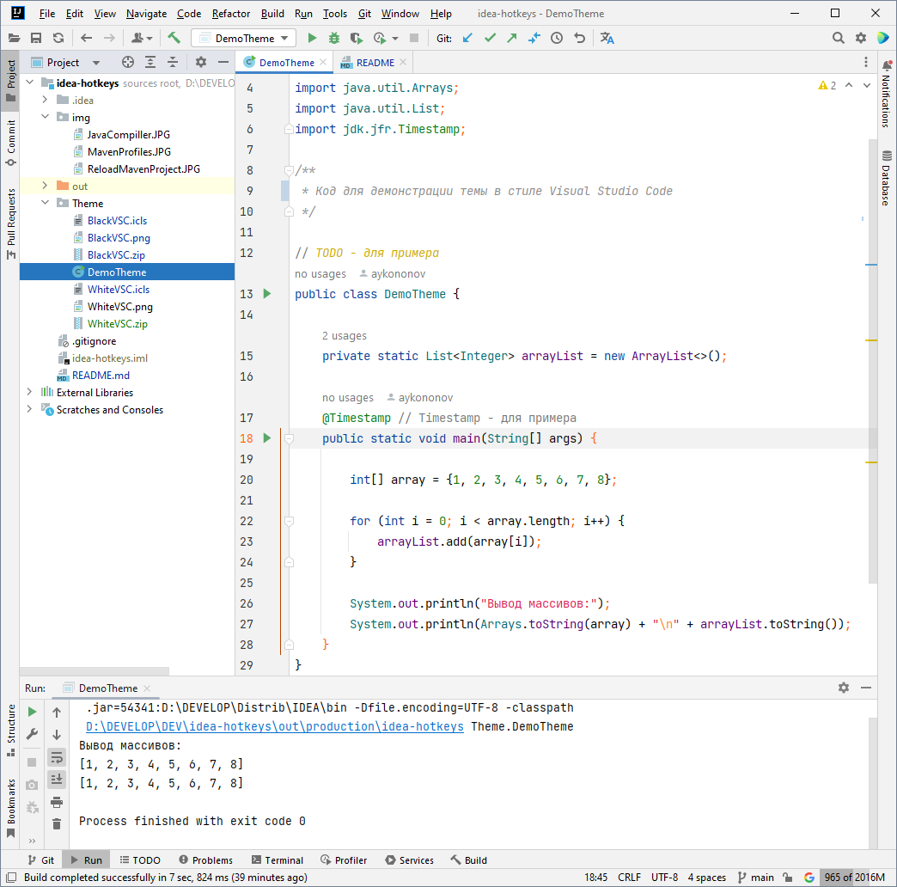

### IntelliJ IDEA - Hotkeys (Горячие клавиши)

<details Java><summary>Java - hotkeys</summary>

```
Поиск/Замена (это земаст!)
   Ctrl + N               поиск класса, далее ALT+(-> / <-) - выбор ищем Files, All и т.д.
   Ctrl + F               поиск на текущем классе  
   Ctrl + R               автозамена на текущем классе
   Ctrl + Shift + F       поиск выражений в проекте/модулях/директориях
   Ctrl + Left Mouse      провалиться в метод/класс и т.д. чтобы прочитать про него
   Ctrl + ALT + (<-)      вернуться назад, или вперед (ВАЖНО)
   Ctrl + B               на классе/методе подняться до объявления класса/метода, 
                          а если еще раз нажать в объявлении, то увидим, где  используется класс/метод
   Ctrl + ALT + L         авто выравнивание кода
   Ctrl + Y               удалить строку (целиком)
   Ctrl + X               вырезать строку (целиком)
   Ctrl + D               создать дубликат строки
   Ctrl + W + W + ...     выделение кода (слово -> строка -> блок -> метод -> класс и тд)
   Ctrl + Shift + W       обратное снятие выделения
   Ctrl + Insret          выделение строки целиком
   Shift + End            выделить все что справа от курсора в строке

   Ctrl + Shift + [стрелка выше/ниже]     перемещение вверх/вниз строки в коде

Запилить кусок кода в структуру:
   1. Ctrl + W    много раз до готовности
   2. Ctrl + Alt + T
   3. [нажать цифру на клаве, например '6'  =  try{} catch{}]

Создание структур с нуля:
' fori ' + (Tab или Enter) + Tab   сразу забиваем второй критерий в цикле for и цикл готов!
' foreach ' + (Tab или Enter)      шаблон для цикла типа ' for each ' - просто добавь воды)
' iter ' + (Tab или Enter)         перебрать элементы коллекции

Быстрая отладка.
   Shift + F9      запуск отладки
   F8              построчный прогон без захода в методы
   F7              с заходом в методы
   Alt + F8        открыть окно эмуляции (=отладка в отладке)
   Alt + F9        прогнать до курсора

Атомарная отладка с заходом в контекстные методы:
   ставим breakpoint на строке public static void main => Shift + F9 => F7, F7...

Рефакторинг.
   Shift + F6      переименовать переменную
   Ctrl + F6       изменить сигнатуру метода

Навигация:
   Ctrl + Q        где стоит курсор, показать подробности метода/класса/значения и т.д.
   Ctrl + P        напомнить сигнатуру
   Alt + F7        где стоит курсор, показать все места где используется метод/класс/значение и т.д.
   Alt + 1         скрыть/показать панель 'Project'
   Ctrl + Alt + O  удалить неисп. импорты
   Alt + [стрелка влево/вправо]    перемещение по закладкам

Промежуточная обработка текста, который вы откуда то скопировали:
0. Ctrl + C        на тексте неважно откуда
1. WIN + R         окно винды ВЫПОЛНИТЬ...
2. Ctrl + V        и редактируем, убираем лишнее
3. Ctrl + A        выделяем результат редактирования
4. Ctrl + C        копируем выделенный результат редактирования
5. Ctrl + V        вставляем куда нужно
   
Быстрое создание переменной (если написали метод/экземпляр, который что-то возвращает, 
а нужно результат запилить на переменную) Alt+Enter, [introduce local variable] Enter
```

</details>

<details Редактор><summary>Editor - hotkeys</summary>

```
Ctrl + Shift + U        Переключить в "ВЕРХНИЙ/нижний" регистр 
Ctrl + Z                Undo, отменить последнее действие  
Ctrl + Shift + Z        Redo, отменить последнюю отмену действия  
Ctrl + Shift + V        Расширенная вставка из буфера обмена (с историей)  
Ctrl (+ Shift) + W      Инкрементальное выделение выражения  
Ctrl + влево/вправо     Перемещение между словами  
Ctrl + вверх/вниз       Прокрутка кода без изменения позиции курсора  
Ctrl + Home/End         Переход в начало/конец файла  
Shift + Del (Ctr + Y)   Удаление строки, отличие в том, где потом окажется курсор  
Ctrl + Del              Удалить от текущей позиции до конца слова  
Ctrl + Backspace        Удалить от текущей позиции до начала слова  
Ctrl + D                Дублировать текущую строку  
Tab / Shift + Tab       Увеличить/уменьшить текущий отступ  
Ctrl + Alt + I          Выравнивание отступов в коде  
Ctrl + Alt + L          Приведение кода в соответствие code style  
Ctrl + /                Закомментировать/раскомментировать текущую строку  
Ctrl + Shift + /        Закомментировать/раскомментировать выделенный код  
Ctrl + -/+              Фолдинг, свернуть/развернуть  
Ctrl + Shift + -/+      Фолдинг, свернуть/развернуть все  
Ctrl + Shift + .        Сделать текущий скоуп сворачиваемым и свернуть его  
Ctrl + .                Сделать текущий скоуп несворачиваемым  
Ctrl + R                Замена в тексте  
Ctrl + Shift + R        Замена во всех файлах
Ctrl + W + W            Выделить всю строку  
```

**Окна, вкладки:**

```  
Alt + влево/вправо      Перемещение между вкладками
Ctrl + F4               Закрыть вкладку
Alt + циферка           Открытие/закрытие окон Project, Structure, Changes и тд
Ctrl + Tab              Switcher, переключение между вкладками и окнами
Shift + Esc             Закрыть активное окно
F12                     Открыть последнее закрытое окно
Ctrl + колесико         Zoom, если он был вами настроен:
                        (Settings -> Editor -> General | Mouse Control , ставим галочку на 'Change font size with Ctrl + Mouse')
```

**Закладки:**

```  
F11                     Поставить или снять закладку  
Ctrl + F11              Аналогично с присвоением буквы или цифры  
Shift + F11             Переход к закладке (удаление — клавишей Delete)  
Ctrl + Число            Быстрый переход к закладке с присвоенным числом  
```

**Подсказки и документация:**

```  
Ctrl + Q                Документация к тому, на чем сейчас курсор  
Ctrl + Shift + I        Показать реализацию метода или класса  
Alt + Q                 Отобразить имя класса или метода, в котором мы находимся  
Ctrl + P                Подсказка по аргументам метода  
Ctrl + F1               Показать описание ошибки или варнинга  
Alt + Enter             Показать, что нам предлагают «лампочки»  
```

**Поиск:**

```  
Дважды Shift            Быстрый поиск по всему проекту  
Ctrl + Shift + A        Быстрый поиск по настройкам, действиям и тд  
Alt + вниз/вверх        Перейти к следующему/предыдущему методу  
Ctrl + [ и Ctr + ]      Перемещение к началу и концу текущего скоупа  
Ctrl + F                Поиск в файле  
Ctrl + Shift + F        Поиск по всем файлам (переход — F4)  
Ctrl + F3               Искать слово под курсором   
F3 / Shift + F3         Искать вперед/назад  
Ctrl + G                Переход к строке или строке:номеру_символа  
Ctrl + F12              Список методов с переходом к их объявлению  
Ctrl + E                Список недавно открытых файлов с переходом к ним  
Ctrl + Shift + E        Список недавно измененных файлов с переходом к ним  
Ctrl + H                Иерархия наследования текущего класса и переход по ней  
Ctrl + Alt + H          Иерархия вызовов выбранного метода  
Ctrl + N                Поиск класса по имени и переход к нему  
Ctrl + Shift + N        Поиск файла по имени и переход к нему  
Ctrl + B                Перейти к объявлению переменной, класса, метода  
Ctrl + Alt + B          Перейти к реализации  
Ctrl + Shift + B        Определить тип и перейти к его реализации  
Shift + Alt + влево     Перемещение назад по стеку поиска  
Shift + Alt + вправо    Перемещение вперед по стеку поиска  
F2 / Shift + F2         Переход к следующей/предыдущей ошибке  
Shift + Alt + 7         Найти все места, где используется метод/переменная  
Ctrl + Alt + 7          Как предыдущий пункт, только во всплывающем окне
```

**Генерация кода и рефакторинг:**

```  
Ctrl + Space            Полный автокомплит  
Ctrl + Shift + Space    Автокомплит с фильтрацией по подходящему типу  
Alt + /                 Простой автокомплит по словам, встречающимся в проекте  
Ctrl + I                Реализовать интерфейс  
Ctrl + O                Переопределить метод родительского класса  
Ctrl + J                Генерация шаблонного кода (обход по итератору и тд)  
Ctrl + Alt + J          Обернуть выделенный код в один из шаблонов  
Alt + Insert            Генератор кода — сеттеров, зависимостей в pom.xml и тд  
Shift + F6              Переименование переменной, класса и тд во всем коде  
Ctrl + F6               Изменение сигнатуры метода во всем коде  
F6                      Перемещение метода, класса или пакета  
F5                      Создать копию класса, файла или каталога  
Shift + F5              Создать копию класса в том же пакете  
Alt + Delete            Безопасное удаление класса, метода или атрибута  
Ctrl + Alt + M          Выделение метода  
Ctrl + Alt + V          Выделение переменной  
Ctrl + Alt + F          Выделение атрибута  
Ctrl + Alt + C          Выделение константы (public final static)  
Ctrl + Alt + P          Выделение аргумента метода  
Ctrl + Alt + N          Инлайнинг метода, переменной, аргумента или константы  
Ctrl + Alt + O          Оптимизация импортов (Удаляет все НЕиспользуемые import`ы) 
```

**Прочее:**

```  
Ctrl + ~                Быстрое переключение цветовой схемы, code style и тд  
Alt + F12               Открыть/закрыть терминал  
F10                     Запустить последнюю запущенную программу или тест  
Shift + F10             Запустить открытую в редакторе программу или тест  
Shift + Alt + F10       Запустить что-то из списка того что запускалось раньше  
Ctrl + F2               Остановить программу  
Ctrl + Alt + A          Добавить в систему контроля версий  
Ctrl + K                Сделать коммит в систему контроля версий  
Ctrl + Shift + K        Сделать пуш в систему контроля версий  
Ctrl + Shift + P        В Scala-плагине определяет implicit параметры  
Ctrl + Shift + Q        В Scala-плагине определяет implicit преобразования  
```

</details>

<details Reload maven><summary>How to reload all maven projects</summary>

Перезагрузить все проекты Maven (Reload All Maven Projects)


Если вы работаете в IntelliJ, есть четыре независимых способа обновления репозиториев maven. Каждый из них обновляет
другой локальный репозиторий на вашем компьютере или обновляет их по-разному.

```
1. mvn -U clean install
2. Ctrl + Shift + A - Reimport
3. В окне Maven (справа) -> нажать "Круглые стрелки"
4. Ctrl+Alt+S -> Build, Execution, Deployment -> Build Tools -> Maven -> Repositories -choose rep - update
```

Что интересно, часто говорят, что последнее обновление совпадает с круглыми стрелками в окне Maven. Но, по моему опыту,
они совершенно разные! Доказательство: нашему большому проекту не удалось выполнить последнее обновление, но он
существует и успешно работает без него. И двойные круглые стрелки работают нормально.

Каждый из этих четырех может помочь вам с вашими проблемами и / или найти собственные проблемы. Например, для запуска
нашего реального проекта нужен только первый, но для тестирования в IntelliJ нам также нужны 2 и 3. Конечно, кому-то
тоже нужно 4. (Почему еще он есть в IntelliJ?)

</details>

### IntelliJ IDEA - Theme in style Visual Studio Code (Тема в стиле Visual Studio Code)

<details Темы><summary>Темы для IntelliJ IDEA в стиле Visual Studio Code</summary>
<blockquote>

**Черная тема для IntelliJ IDEA в стиле Visual Studio Code**

_Скачайте и извлектите файл_ [BlackVSC.icls](./Theme/BlackVSC.zip "скачать BlackVSC.zip") _из архива._


**Белая тема для IntelliJ IDEA в стиле Visual Studio Code**

_Скачайте и извлектите файл_ [WhiteVSC.icls](./Theme/WhiteVSC.zip "скачать WhiteVSC.zip") _из архива._



### Импорт темы в IntelliJ IDEA


</blockquote></details>
